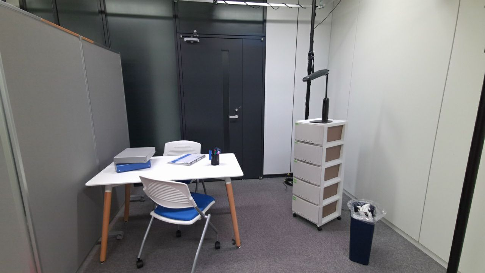
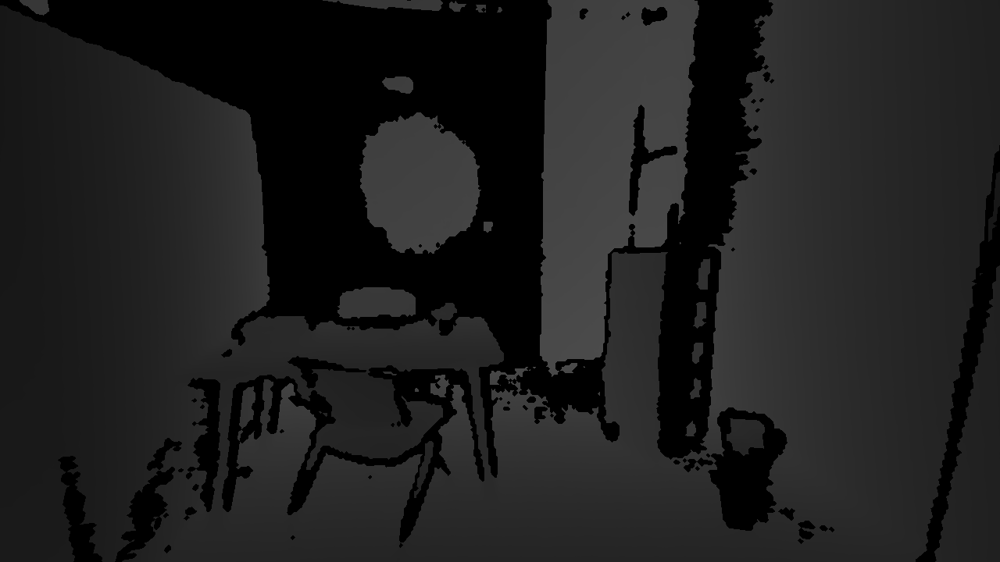
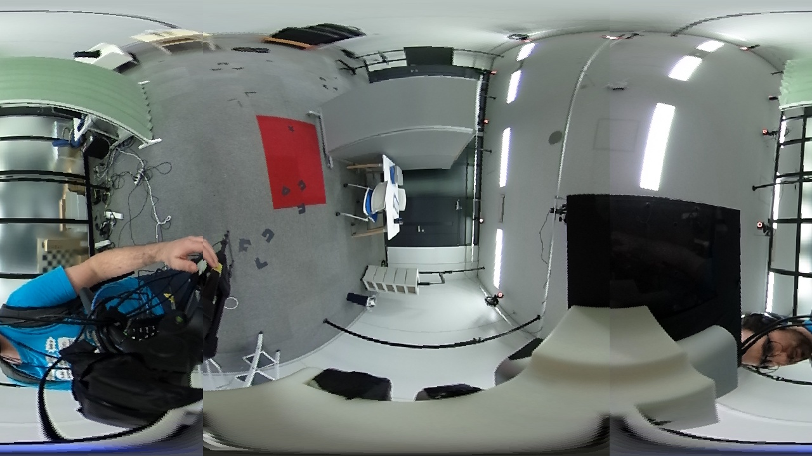
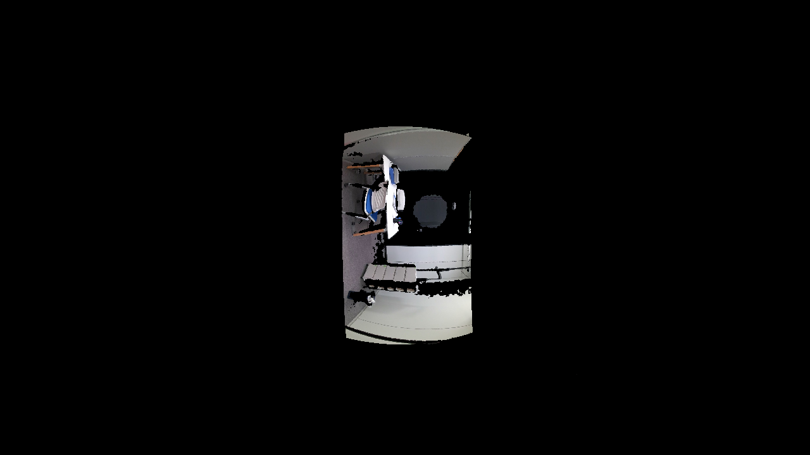
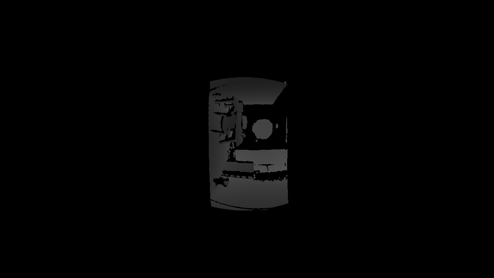
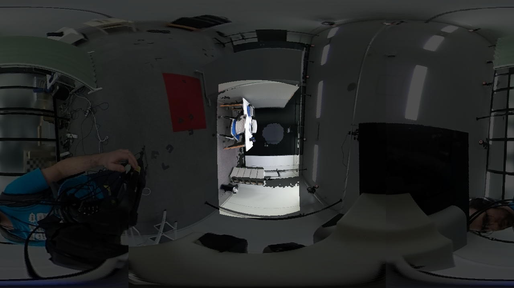

# rospersp2equi

`rospersp2equi` is a ROS1 package designed to transform perspective images into equirectangular format (Equi-Rectangular Projection, ERP), supporting both color and depth images. This package has used the Azure Kinect camera, and its RGB and depth images have been transformed into the ERP format. The final equirectangular projection is aligned with the reference system of the ThetaS camera.

## Installation

### Prerequisites

Before using this package, ensure you have the following dependencies installed:

- ROS (compatible with your system)
- `roscpp`
- `std_msgs`
- `sensor_msgs`
- `cv_bridge`
- `image_transport`
- [VISP library](https://visp.inria.fr) (`libvisp`)
- [PER library](https://github.com/PerceptionRobotique/libPeR_base) (`libper`)

### Setup

1. Clone the repository into your ROS workspace:
    ```bash
    cd ~/catkin_ws/src
    git clone <your_repository_url>
    cd ~/catkin_ws
    ```

2. **Important**: Before building, make sure to:
    - Add the correct rotation matrix and translation vector inside the `perps2.cpp` source file.
    - Use your own perspective camera parameters (e.g., `fx`, `fy`, `cx`, `cy`, distortion coefficients) to match the setup of your camera. For example, this package used the Azure Kinect camera.

    - Add the correct rotation matrix and translation vector inside the `perps2.cpp` source file to align the Azure Kinect camera with the ThetaS system. This transformation is crucial for ensuring that the output equirectangular images correspond to the ThetaS camera's coordinate system.

  For example, the following transformation matrix is used:

    ```
        rotationMatrix << 0.01348508, -0.99950615, -0.02838054,  
                          0.99985291,  0.01377857, -0.01017193,  
                          0.01055796, -0.02823921,  0.99954551;

        translationVector << 0.08626425, 0.14222383, 0.02128052;
    ```

3. Build the package:
    ```bash
    catkin_make
    source devel/setup.bash
    ```

4. Ensure the correct paths for `libper` are set in your environment:
    ```bash
    export CMAKE_PREFIX_PATH="/root/libPeR_base/cmake:$CMAKE_PREFIX_PATH"
    export CMAKE_MODULE_PATH="/root/libPeR_base/cmake:$CMAKE_MODULE_PATH"
    ```

## Running the Package

To run the `rospersp2equi` package, use the provided launch file:

```bash
roslaunch rospersp2equi persp2equi.launch input_bagfile:=/path/to/your/input.bag
```

## Launch File Description

- **`input_bagfile`**: Path to the input rosbag containing the RGB and depth images.

Default topics are set to:

- **`/Azure/rgb/image_raw`**: Input topic for RGB images.
- **`/Azure/depth_to_rgb/image_raw`**: Input topic for depth images.

These can be modified in the launch file if necessary.

The generated images will be saved in the directory specified in the launch file under the **`savePath`** parameter.

## Example Workflow

1. Prepare your rosbag with the RGB and depth images.
2. Run the package with the following command:

    ```bash
    roslaunch rospersp2equi persp2equi.launch input_bagfile:=/path to/file.bag
    ```

This will process the images and output them in equirectangular format (ERP) to the specified output directory as defined in the `savePath` argument in the launch file.

### Before and After Transformation

Below are examples of the images before and after the transformation:

#### Perspective Color and Depth Images:

<p align="center">
  
  
</p>
<p align="center">
  Rgb Azure image (left) and Depth Azure image (right)
</p>

#### Equi-Rectangular Color Image - ThetaS Reference:
<p align="center"> 
   
</p> 
<p align="center"> 
RGB Equi-Rectangular ThetaS image used as the reference for the transformation from Azure Kinect to the ThetaS coordinate system. 
</p>

#### ERP (Equi-Rectangular Projection) Color and Depth Images:

<p align="center">
  
  
</p>
<p align="center">
  Rgb ERP Azure image (left) and Depth ERP Azure image (right)
</p>

#### Overlapping ERP Images - Azure Kinect to ThetaS Calibration:

<p align="center"> 
 
</p> 
<p align="center"> 
Overlapping of the Azure Kinect and ThetaS RGB equirectangular images, showing the successful calibration between the two cameras. 
</p>

## Author

**Grace Sevillano**  
[GitHub](https://github.com/GraceSevillano)
